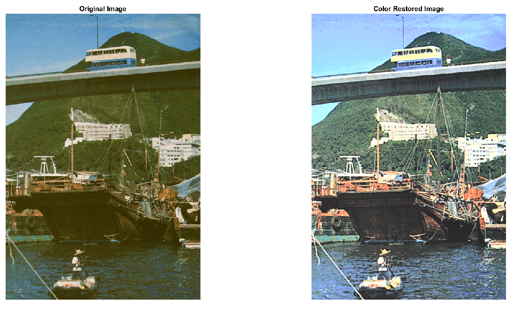

# Vintage-Photo-Restoration-Using-Traditional-Image-Processing-Techniques
Restoration of vintage photographs poses significant challenges in image processing due to the continuous occurrence of physical degradation over time. These photos are prone to fading, discoloration, scratches, and tears. To successfully restore these photos, it is necessary to not only remove noise and rectify damage but also to enhance faded features and colors, all without the use of extensive machine-learning techniques. This project aims to create a processing pipeline that employs traditional image processing techniques to recover and preserve the historical and sentimental value of vintage images. The image restoration procedure included numerous fundamental procedures, including grayscale conversion, histogram equalization, noise reduction, sharpening filter, morphological operations, edge detection, brightness adjustment, local contrast enhancement, artifact removal, and color restoration. The techniques used for image processing procedures somewhat recovered the vintage pictures. Contrast and brightness were much increased, while noise and artifacts were substantially eliminated. Adjusting the color channels gave the photographs a vivid, modern appearance while retaining their historical context. The finalized images demonstrated improved clarity, vibrant colors, and reduced noise, thereby meeting the project's objectives. Traditional image processing techniques, when used properly, can efficiently restore and update vintage pictures. This initiative highlights the potential of these techniques for improving image quality and preserving historical objects. Future research could look into more advanced approaches and automated systems to help enhance and streamline the restoration process.

# Methodology
The methodology for this project involves a methodical approach to recovering vintage pictures using traditional image processing techniques. The restoration process is separated into several key steps, each of which uses distinct algorithms and methodologies to accomplish the desired results. These procedures are as follows:

- Grayscale Conversion
- Gaussian Filter
- Apply Sharpening Filter
- Canny Edge Detection
- Apply Histogram Equalization
- Brightness Adjustment
- Morphological Operations (Closing)
- Local Contrast Enhancement Using Contrast Limited Adaptive Histogram Equalization (CLAHE)
- Artifact Removal
- Color Restoration

# Result Evaluation
The results of this project demonstrate the effectiveness of traditional image processing techniques in achieving a significant improvement in image clarity, contrast, and overall appearance. By implementing our methodology, we have been able to restore the visual appear-
ance of the image to some extent. We were also able to give it a modern look ans still preserving its historical context.

# Discussion
The approach taken in this project to restore vintage photographs using traditional image processing techniques has shown promising results. Each step in the processing pipeline was carefully chosen to address specific challenges associated with vintage pictures.The results indicate that the combination of grayscale conversion, noise reduction through Gaussian filtering, sharpening, and histogram equalization significantly enhanced the clarity and contrast of the images. The use of CLAHE for local contrast enhancement was particularly effective in improving the visibility of details without over amplifying noise. Artifact removal using region-based filling techniques success- fully mitigated visible imperfections, leading to cleaner images.

# Parameter Sensitivity
An interesting aspect of this project is the sensitivity of various parameters involved in the processing steps. For instance, in the Gaussian filter, the standard deviation σ needed careful adjustment. Too low σ value would leave noise unfiltered, while too high value could blur important details. In the sharpening filter, parameters like Radius and Amount must be fine-tuned to avoid introducing artifacts or making the image look unnatural. The CLAHE ClipLimit and Distribution parameters also required careful calibration to balance detail enhancement and noise suppression.

# Challenges and Improvements
One challenge encountered was ensuring that the edge detection did not introduce unnecessary edges. As we have seen in the results that we detected some unnecessary edges. Therefore, we adjusted the histogram equalization to remove those edges. Another interesting challenge was maintaining the balance between contrast enhancement and preserving natural image aesthetics. Over-processing could lead to an unrealistic appearance, while under-processing might not reveal enough detail.

The project demonstrated a clear understanding of the implementation and tuning of various image processing algorithms. The success of each step was highly dependent on the appropriate choice and adjustment of parameters. For example, in histogram equalization, methods like histeq and imadjust were combined to achieve a uniform and enhanced contrast. Furthermore, dividing the original RGB image into R, G, and B channels, modifying color values, clipping to [0, 255], and combining them to generate a color-adjusted image required extensive research and understanding of the color restoration process.

# Conclusion
This project successfully addressed the problem of restoring vintage photographs using traditional image processing techniques. By following a structured processing pipeline, the restored images exhibited significant improvements in clarity, contrast, and overall visual appeal. Each step, from grayscale conversion to artifact removal and color restoration, played a crucial role in achieving the final results. The methodology proved effective in enhancing the historical and sentimental value of vintage photographs without relying on extensive machine learning techniques. This approach highlights the potential of traditional image processing methods in preserving and updating historical images. Future research could explore more advanced techniques and automated systems to further enhance and streamline the restoration process.
